# Set Up a Kanban Board on GitHub

Use a GitHub project board to plan your work and track the milestones from [01_assignment.md](01_assignment.md). Set this up together as a team at the start of the project.

The setup has six stages: create your repository, create the board, give your team access, add tasks, set up milestones, then connect the two. Work through them in order.

## 1. Create Your Project Repository

1. Click on "Use this template" (the blue button).
   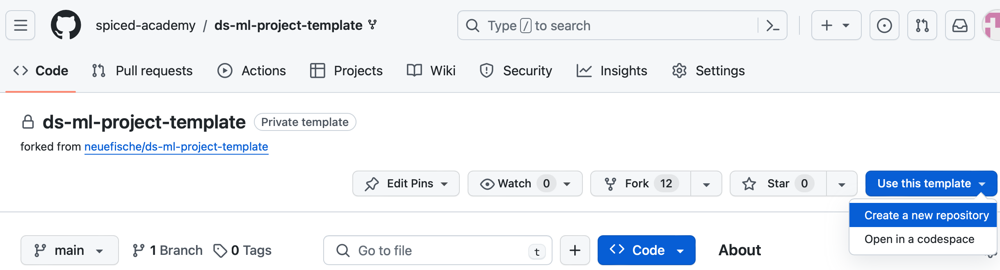

2. Create a new repository with a relevant name. The owner should be your own account.
   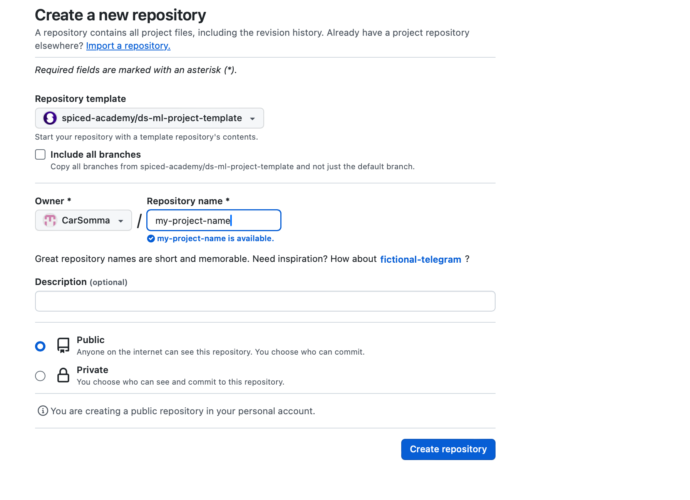

## 2. Create the Kanban Board

1. In your new repository, go to "Projects" and click "Link a project" (the blue button). If you have not created a project yet, use the arrow navigation to create one on your profile. You can add this project to your repository at the end.
   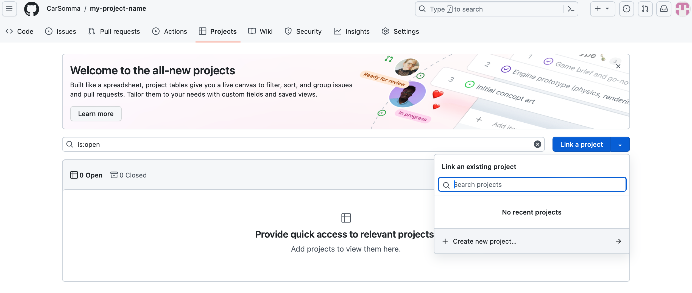

2. You will be taken to your profile's projects and shown a "create project" window. Choose the "Board" view, not the "Table" view.
   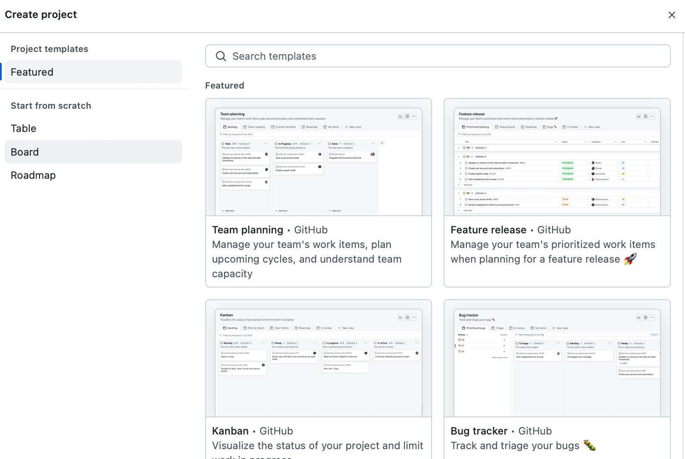

3. Change the name of your board to match your chosen ML project, then click the "Create project" blue button. You have now created a Kanban board.
   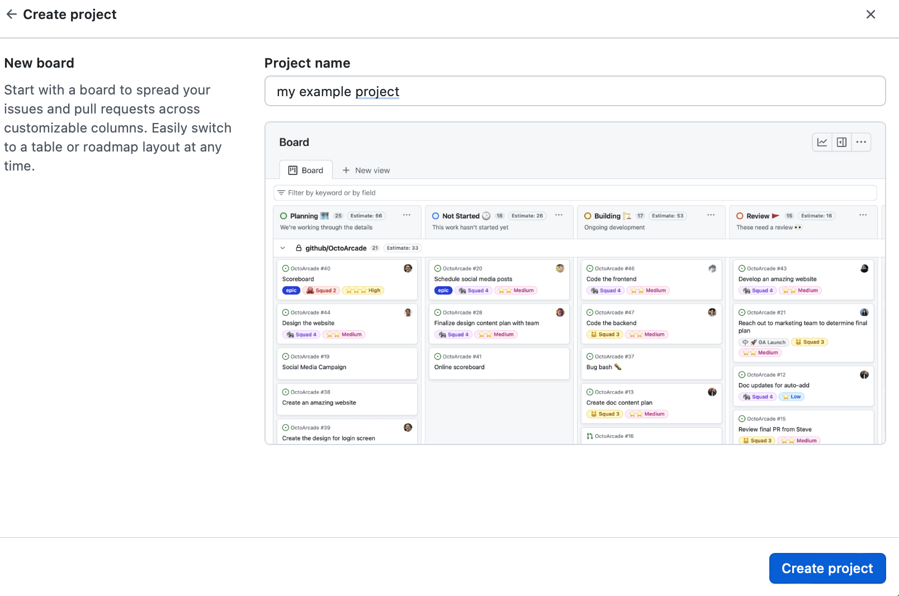

## 3. Give Your Team Access

1. Click the three dots at the top right of the board, then go to "Settings".
   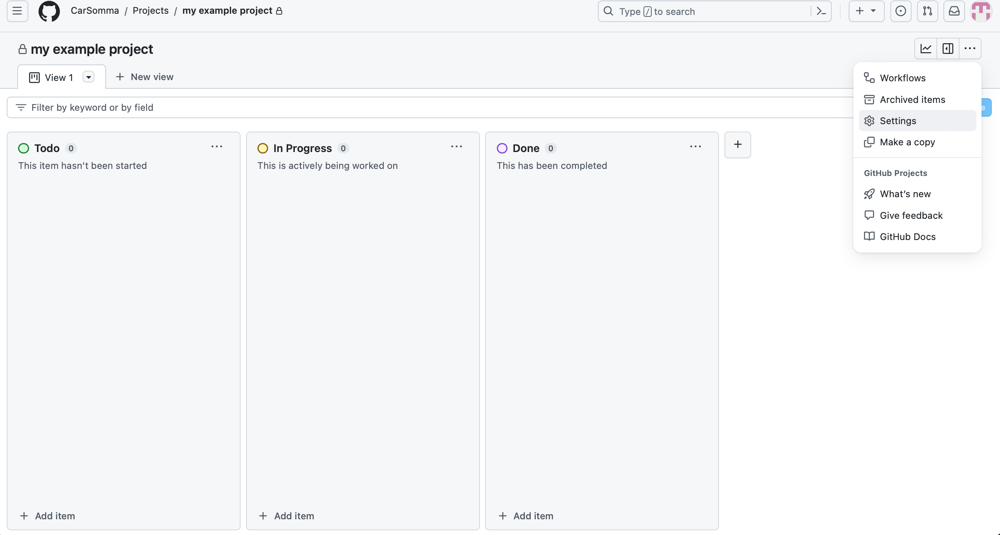

2. Click "Manage access". Add your teammates by searching for their GitHub handle. Change their role from "Write" to "Admin", then click the blue "Invite" button. Repeat for all team members.
   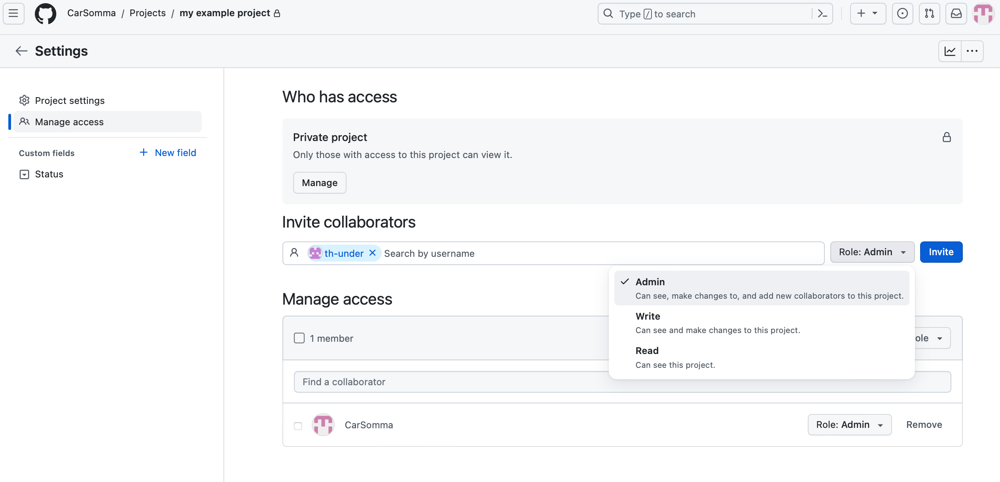

## 4. Add Tasks as Issues

1. Go back to the Kanban board and, at the bottom, add action items with relevant names, for example "load data" or "get statistics".
   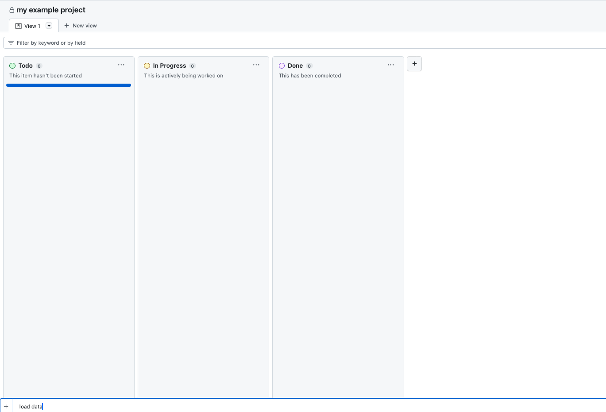

2. Convert an added item to an issue by clicking the three dots on that item.
   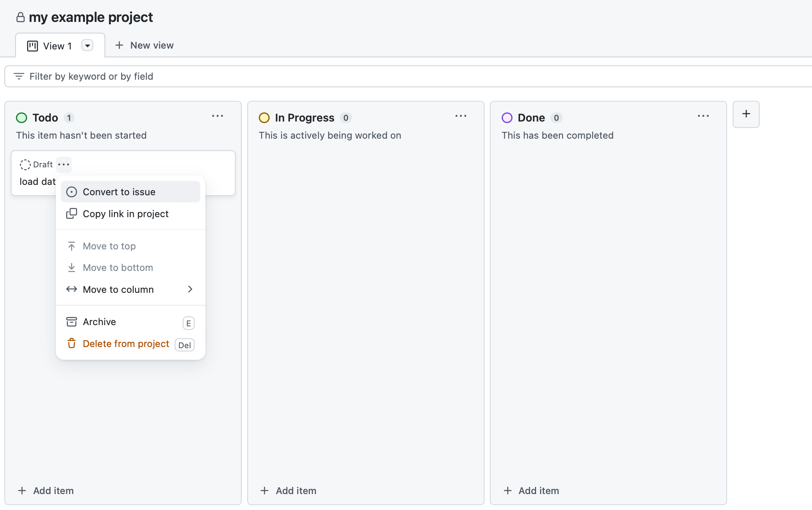

3. Select the repository you created so the issue is added to it (for example "my-project-name").
   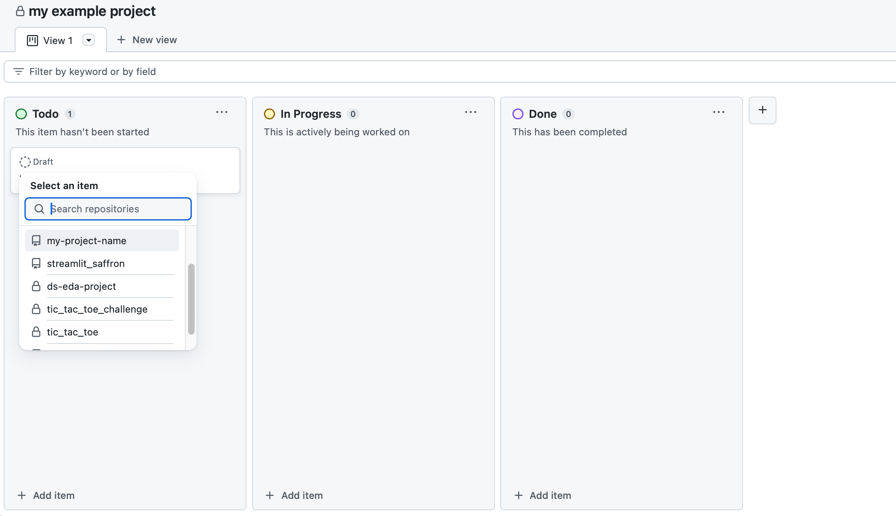

## 5. Set Up Milestones

1. In your project repository, go to "Issues", then "Milestones".
   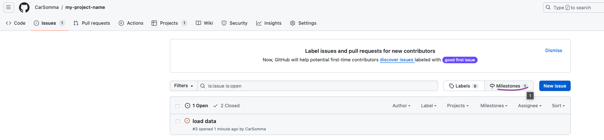

2. Click "New milestone".

3. Give the milestone a due date and a description, following the example provided by the coaches. The description should cover:

   A) What needs to be completed to be done with the milestone.

   B) The definition of done: what your result looks like when the milestone is complete (check the provided format).
   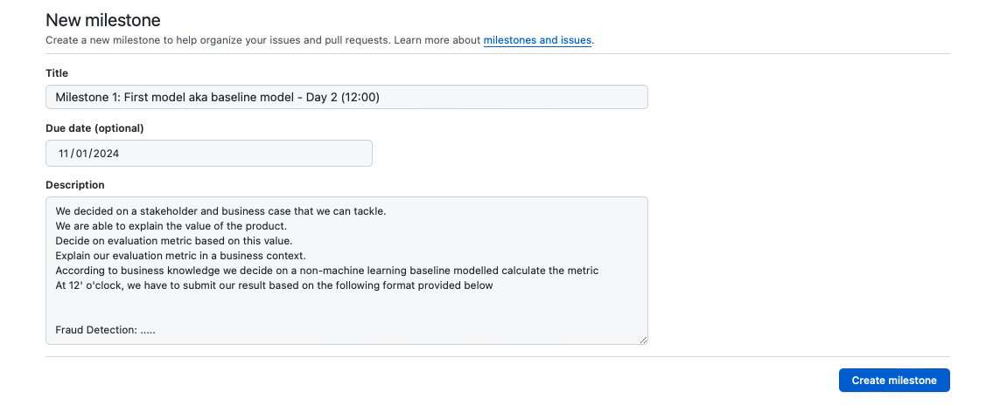

## 6. Link Issues to Milestones and People

1. Go to "Issues".

2. Assign issues to milestones.
   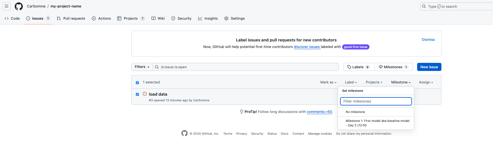

3. Give each issue assignees (the people who will work on the task).
   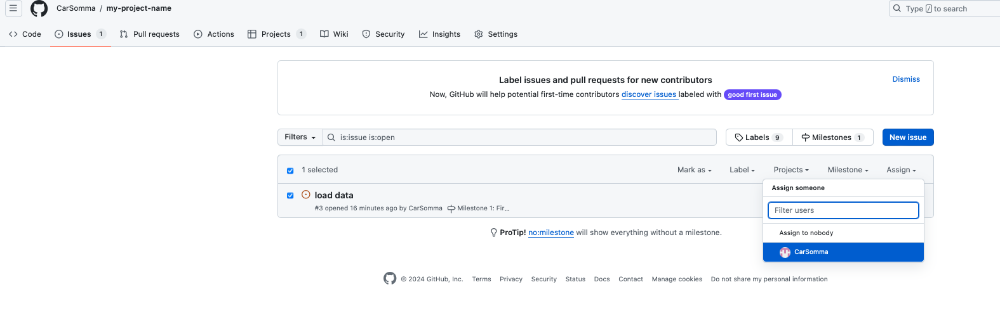

## Optional: Add Workflows

Workflows can help keep your Kanban board automatically on track.

1. Select the project you created in the steps above.
2. Click the three dots at the far right of the board.
3. Select "Workflows" as the first option.
4. Activate the ones you feel are useful for your project.
5. Go back to your project repository.
