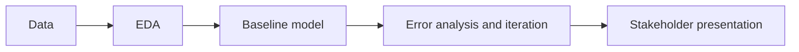

# Machine Learning Project Template

A starting point for your team machine learning project. The repository ships an example notebook that trains a simple model with minimal cleaning and feature selection. Use it as scaffolding, then build your own project on top of it.

The example uses the [coffee quality dataset](https://github.com/jldbc/coffee-quality-database).

## Learning Objectives

By the end of this repository, you should be able to:

- Work on a data science project as a team, sharing the work across the data science lifecycle.
- Frame a business problem as a machine learning task and choose a performance metric that fits the value you want to create.
- Build a baseline model, then iterate with error analysis and at least three algorithms (including cross validation and hyperparameter tuning).
- Communicate your findings and recommendations to a non-technical audience in a short presentation.

## Learning Path

Your project follows the data science lifecycle:



Start with the assignment, set up your board, then use the example notebook as a reference:

| File / Folder | Description |
|---|---|
| [**Assignment**](01_assignment.md) | The project brief: timeline, milestones, project options, deliverables, and things to think about. |
| [**Kanban Board**](02_kanban_board.md) | Step-by-step setup of a GitHub project board to plan and track your work. |
| [**EDA and Modeling**](03_eda-and-modeling.ipynb) | Worked example of selecting features, doing minimal cleaning, and training a simple model. |

### Additional Folders and Files

| File / Folder | Description |
|---|---|
| [**Data**](data/) | Where your datasets go. |
| [**Models**](models/) | Where trained models are saved. |
| [**Assets**](assets/) | Screenshots used in the Kanban board guide. |
| [**pyproject.toml**](pyproject.toml) | Project configuration and dependencies. |
| [**uv.lock**](uv.lock) | Dependency lock file. |

## Setup

> [!NOTE]
> Throughout these steps, text in angle brackets like `<repo-name>` is a **placeholder**. Replace it, including the `< >` brackets, with your own value. For example, `cd <repo-name>` becomes `cd my-ml-project`.

### 1. Create the Repository from the Template

Click **Use this template** on GitHub.

When creating the repository:

- Set yourself as the **Owner**
- Choose a repository name
- Disable **Include all branches**
- Click **Create repository**

> [!IMPORTANT]
> If you are working in pairs or groups, only **one person** should complete this step.

---

### 2. Add Collaborators (Pairs/Groups Only)

If working with teammates:

1. Open the repository on GitHub
2. Go to **Settings → Collaborators**
3. Add your teammates as collaborators
4. Share the repository link with your team

Teammates should accept the invitation before continuing.

---

### 3. Clone the Repository

Copy the SSH URL from the **Code** button on GitHub, then run:

```bash
git clone <copied-ssh-url>
```

The copied SSH URL will look like `git@github.com:<your-username>/<repo-name>.git`.

---

### 4. Move into the Project Folder and Install Dependencies

This installs all dependencies and creates a virtual environment in (`.venv/`).

```bash
cd <repo-name>
uv sync
```

> [!TIP]
> This is your own project, so you will add libraries as you go. Install a new package with `uv add <package>` (for example `uv add xgboost`). It updates `pyproject.toml` and `uv.lock` for the whole team.

---

### 5. Open the Notebook

> [!NOTE]
> Make sure you open VS Code from the project root so it automatically detects the environment created by `uv sync`.

Launch VS Code in the project root folder:

```bash
code .
```

Then open `03_eda-and-modeling.ipynb` and select the Python environment created by `uv sync` as the kernel.

## Handling Merge Conflicts in Notebooks

When working in a team, `.ipynb` files can cause messy merge conflicts because they are JSON based. The `nbdime` tool makes this easier, and `uvx` runs it without adding it to your project dependencies.

Enable the git integration once:

```bash
uvx nbdime config-git --enable
```

When a conflict happens, open the merge tool:

```bash
uvx nbdime mergetool
```

A web interface opens showing both notebook versions side by side. Choose what to keep, save, and close the tool, then:

```bash
git add your_notebook.ipynb
git commit -m "Resolve notebook conflict"
```

> [!TIP]
> When working with notebooks, it's a good idea to clear outputs before committing to reduce the chances of conflicts. You can do this in VS Code with the command palette: `Notebook: Clear All Outputs`.

## References & Further Reading

- [**scikit-learn Documentation**](https://scikit-learn.org/stable/): the library used for modelling, with user guides and examples.
- [**Choosing the Right Estimator**](https://scikit-learn.org/stable/machine_learning_map.html): a visual map for picking a model based on your problem and data.
- [**PEP 8 Style Guide for Python Code**](https://peps.python.org/pep-0008/): the style your notebook should follow.
- [**Jupyter Notebooks in VS Code**](https://code.visualstudio.com/docs/datascience/jupyter-notebooks): how to run notebooks and pick a kernel in VS Code.
- [**uv Documentation**](https://docs.astral.sh/uv/): the package manager that handles Python and dependencies for this repo.
- [**Zindi Competitions**](https://zindi.africa/competitions): real-world challenges, several of which are listed as project options in the assignment.
